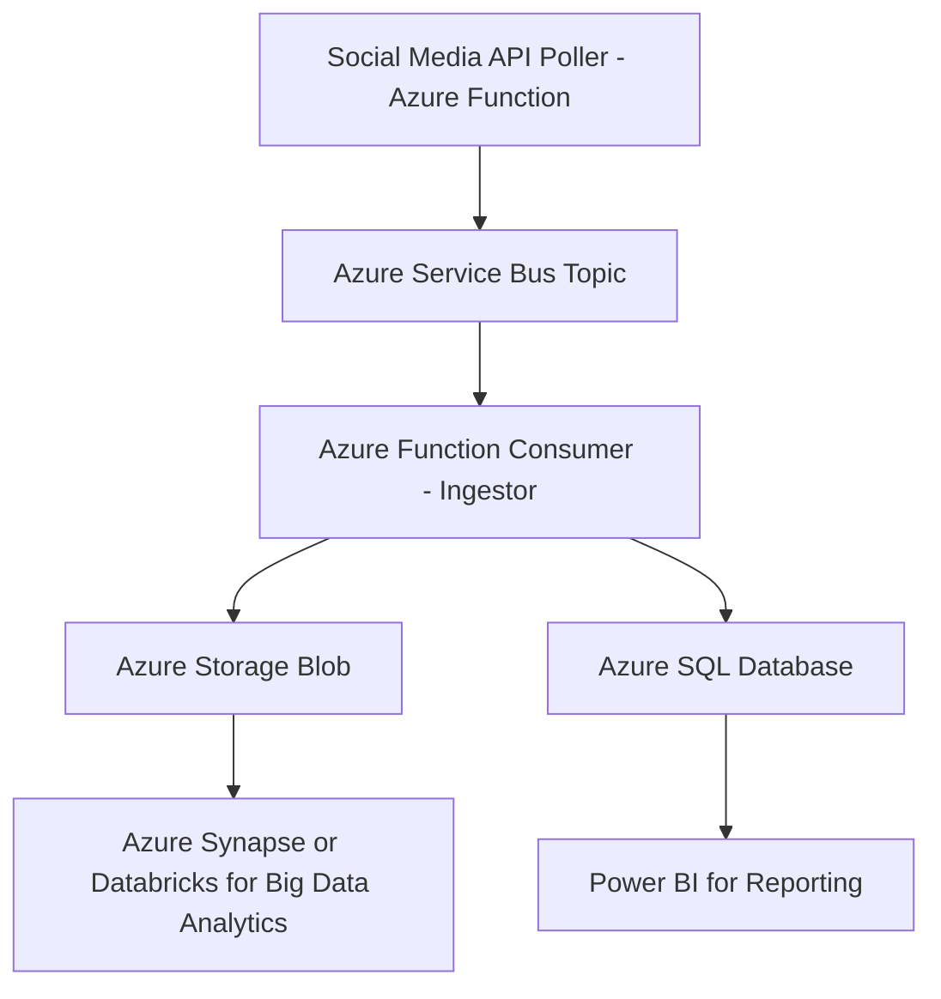

The client wanted to group multiple restaurants onto a single social marketplace. To achieve this, they wanted to pull restaurant-specific information from various social networking sites like Instagram, Foursquare and Twitter. They had targeted to fetch & store the metadata of more than 27,000 restaurants. This huge data had to be analyzed for which the client required an analytics system. In addition, the data of these restaurants had to be updated in the system on a daily basis An important challenge was to understand the APIs of Instagram, Foursquare, Twitter in order to read the restaurant’s metadata. The client's requirement was to rapidly process data from the thousands of restaurants on a daily basis. Moreover to handle this huge data, client wanted to implement Big Data analytics.

This is a great use case involving social media data aggregation, big data processing, and analytics for a **restaurant-centric social marketplace**. Let's break this down into the **overall scenario**, then define the **Azure architecture** and finally the **SQL tables** required for storing and analyzing the data.

---

## 🌐 **Scenario Summary**

The client wants to:

1. Group 27,000+ restaurants in one social marketplace.
2. Fetch metadata from **Instagram**, **Foursquare**, and **Twitter** for each restaurant.
3. Store and update this data **daily**.
4. Process and analyze this data using **Big Data analytics**.
5. Ensure high scalability, reliability, and cost-effective infrastructure.

---

## 🏗️ **Azure Architecture Components**



---

## ⚙️ **Azure Services Used**

| Component | Purpose |
|----------|---------|
| **Azure Function App** | Fetch metadata from Instagram, Twitter, Foursquare via API |
| **Azure Service Bus (Topic)** | Decouples producer (poller) and consumers (ingestors) |
| **Azure Storage Blob** | Stores raw JSON data from APIs |
| **Azure SQL Database** | Structured storage of restaurant metadata |
| **Azure Synapse / Azure Databricks** | Analyze the large volume of restaurant metadata |
| **Power BI** | Data visualization and reporting |
| **Azure Data Factory (optional)** | To schedule daily data movement/refresh pipelines |

---

## 🗃️ **SQL Database Tables Design**

Here are the main tables required to capture metadata, relationships, and update info:

---

### 1. **Restaurants**

```sql
CREATE TABLE Restaurants (
    RestaurantID INT PRIMARY KEY,
    Name NVARCHAR(255),
    Address NVARCHAR(500),
    City NVARCHAR(100),
    State NVARCHAR(100),
    Country NVARCHAR(100),
    ZipCode NVARCHAR(20),
    Latitude FLOAT,
    Longitude FLOAT,
    CreatedAt DATETIME DEFAULT GETDATE()
);
```

---

### 2. **SocialMediaSources**

```sql
CREATE TABLE SocialMediaSources (
    SourceID INT PRIMARY KEY,
    PlatformName NVARCHAR(50),  -- Instagram, Twitter, Foursquare
    APIEndpoint NVARCHAR(255),
    AuthType NVARCHAR(50)       -- OAuth2, BearerToken, etc.
);
```

---

### 3. **RestaurantSocialProfiles**

```sql
CREATE TABLE RestaurantSocialProfiles (
    ProfileID INT PRIMARY KEY,
    RestaurantID INT FOREIGN KEY REFERENCES Restaurants(RestaurantID),
    SourceID INT FOREIGN KEY REFERENCES SocialMediaSources(SourceID),
    SocialHandle NVARCHAR(100),
    LastChecked DATETIME,
    IsActive BIT,
    UNIQUE (RestaurantID, SourceID)
);
```

---

### 4. **SocialMediaMetadata**

```sql
CREATE TABLE SocialMediaMetadata (
    MetadataID INT PRIMARY KEY,
    ProfileID INT FOREIGN KEY REFERENCES RestaurantSocialProfiles(ProfileID),
    PostID NVARCHAR(100),
    PostURL NVARCHAR(500),
    Caption NVARCHAR(MAX),
    Likes INT,
    Comments INT,
    CreatedTime DATETIME,
    RawData NVARCHAR(MAX),     -- Optional: JSON blob
    IngestedAt DATETIME DEFAULT GETDATE()
);
```

---

### 5. **DailyFetchLog**

```sql
CREATE TABLE DailyFetchLog (
    LogID INT PRIMARY KEY,
    ProfileID INT FOREIGN KEY REFERENCES RestaurantSocialProfiles(ProfileID),
    FetchDate DATE,
    Status NVARCHAR(50),  -- Success, Failed, Partial
    Message NVARCHAR(MAX),
    RetryCount INT DEFAULT 0
);
```
Below are the **stored procedures** for `CREATE`, `READ`, `UPDATE`, and `DELETE` operations (CRUD) for each of the **main SQL tables** discussed earlier in the restaurant social marketplace scenario.

Let’s focus on the following tables:

1. `Restaurants`  
2. `RestaurantSocialProfiles`  
3. `SocialMediaMetadata`  

---

## 🛠️ 1. `Restaurants` Table – Stored Procedures

### ✅ Create

```sql
CREATE PROCEDURE sp_CreateRestaurant
    @Name NVARCHAR(255),
    @Address NVARCHAR(500),
    @City NVARCHAR(100),
    @State NVARCHAR(100),
    @Country NVARCHAR(100),
    @ZipCode NVARCHAR(20),
    @Latitude FLOAT,
    @Longitude FLOAT
AS
BEGIN
    INSERT INTO Restaurants (Name, Address, City, State, Country, ZipCode, Latitude, Longitude)
    VALUES (@Name, @Address, @City, @State, @Country, @ZipCode, @Latitude, @Longitude)
END
```

### 📖 Read

```sql
CREATE PROCEDURE sp_GetRestaurantById
    @RestaurantID INT
AS
BEGIN
    SELECT * FROM Restaurants WHERE RestaurantID = @RestaurantID
END
```

### ✏️ Update

```sql
CREATE PROCEDURE sp_UpdateRestaurant
    @RestaurantID INT,
    @Name NVARCHAR(255),
    @Address NVARCHAR(500),
    @City NVARCHAR(100),
    @State NVARCHAR(100),
    @Country NVARCHAR(100),
    @ZipCode NVARCHAR(20),
    @Latitude FLOAT,
    @Longitude FLOAT
AS
BEGIN
    UPDATE Restaurants
    SET Name = @Name,
        Address = @Address,
        City = @City,
        State = @State,
        Country = @Country,
        ZipCode = @ZipCode,
        Latitude = @Latitude,
        Longitude = @Longitude
    WHERE RestaurantID = @RestaurantID
END
```

### ❌ Delete

```sql
CREATE PROCEDURE sp_DeleteRestaurant
    @RestaurantID INT
AS
BEGIN
    DELETE FROM Restaurants WHERE RestaurantID = @RestaurantID
END
```

---

## 🛠️ 2. `RestaurantSocialProfiles` Table – Stored Procedures

### ✅ Create

```sql
CREATE PROCEDURE sp_CreateRestaurantSocialProfile
    @RestaurantID INT,
    @SourceID INT,
    @SocialHandle NVARCHAR(100),
    @IsActive BIT
AS
BEGIN
    INSERT INTO RestaurantSocialProfiles (RestaurantID, SourceID, SocialHandle, LastChecked, IsActive)
    VALUES (@RestaurantID, @SourceID, @SocialHandle, GETDATE(), @IsActive)
END
```

### 📖 Read

```sql
CREATE PROCEDURE sp_GetRestaurantProfiles
    @RestaurantID INT
AS
BEGIN
    SELECT * FROM RestaurantSocialProfiles WHERE RestaurantID = @RestaurantID
END
```

### ✏️ Update

```sql
CREATE PROCEDURE sp_UpdateRestaurantSocialProfile
    @ProfileID INT,
    @SocialHandle NVARCHAR(100),
    @IsActive BIT
AS
BEGIN
    UPDATE RestaurantSocialProfiles
    SET SocialHandle = @SocialHandle,
        LastChecked = GETDATE(),
        IsActive = @IsActive
    WHERE ProfileID = @ProfileID
END
```

### ❌ Delete

```sql
CREATE PROCEDURE sp_DeleteRestaurantSocialProfile
    @ProfileID INT
AS
BEGIN
    DELETE FROM RestaurantSocialProfiles WHERE ProfileID = @ProfileID
END
```

---

## 🛠️ 3. `SocialMediaMetadata` Table – Stored Procedures

### ✅ Create

```sql
CREATE PROCEDURE sp_CreateSocialMediaMetadata
    @ProfileID INT,
    @PostID NVARCHAR(100),
    @PostURL NVARCHAR(500),
    @Caption NVARCHAR(MAX),
    @Likes INT,
    @Comments INT,
    @CreatedTime DATETIME,
    @RawData NVARCHAR(MAX)
AS
BEGIN
    INSERT INTO SocialMediaMetadata (
        ProfileID, PostID, PostURL, Caption, Likes, Comments, CreatedTime, RawData, IngestedAt
    )
    VALUES (
        @ProfileID, @PostID, @PostURL, @Caption, @Likes, @Comments, @CreatedTime, @RawData, GETDATE()
    )
END
```

### 📖 Read

```sql
CREATE PROCEDURE sp_GetMetadataByProfile
    @ProfileID INT
AS
BEGIN
    SELECT * FROM SocialMediaMetadata WHERE ProfileID = @ProfileID
END
```

### ✏️ Update

```sql
CREATE PROCEDURE sp_UpdateSocialMediaMetadata
    @MetadataID INT,
    @Caption NVARCHAR(MAX),
    @Likes INT,
    @Comments INT,
    @RawData NVARCHAR(MAX)
AS
BEGIN
    UPDATE SocialMediaMetadata
    SET Caption = @Caption,
        Likes = @Likes,
        Comments = @Comments,
        RawData = @RawData
    WHERE MetadataID = @MetadataID
END
```

### ❌ Delete

```sql
CREATE PROCEDURE sp_DeleteSocialMediaMetadata
    @MetadataID INT
AS
BEGIN
    DELETE FROM SocialMediaMetadata WHERE MetadataID = @MetadataID
END
```

---

Set Up Steps 

Creating a serverless API using Azure that leverages Service Bus to communicate with an SQL Database involves several steps. Here's a high-level overview of how you can set this up:

1. **Set Up Azure SQL Database**:
   - Create an Azure SQL Database instance.
   - Set up the necessary tables and schemas you'll need for your application.

2. **Create Azure Service Bus**:
   - Set up an Azure Service Bus namespace.
   - Within the namespace, create a queue or topic (based on your requirement).

3. **Deploy Serverless API using Azure Functions**:
   - Create a new Azure Function App.
   - Develop an HTTP-triggered function that will act as your API endpoint.
   - In this function, when data is received, send a message to the Service Bus queue or topic.

4. **Deploy 2 Service Bus Triggered Function**:
   - Create another Azure Function that is triggered by the Service Bus queue or topic.
   - This function will read the message from the Service Bus and process it. The processing might involve parsing the message and inserting the data into the Azure SQL Database.

5. **Deploy a Timer Triggered Function**:
   - Create another Azure Function that is triggered when a file is dropped in a container.
   - This function will stream in a file, read it and place on the service bus topic.

6. **Implement Error Handling**:
   - Ensure that you have error handling in place. If there's a failure in processing the message and inserting it into the database, you might want to log the error or move the message to a dead-letter queue.

7. **Secure Your Functions**:
   - Ensure that your HTTP-triggered function (API endpoint) is secured, possibly using Azure Active Directory or function keys.

8. **Optimize & Monitor**:
   - Monitor the performance of your functions using Azure Monitor and Application Insights.
   - Optimize the performance, scalability, and cost by adjusting the function's plan (Consumption Plan, Premium Plan, etc.) and tweaking the configurations.

9. **Deployment**:
   - Deploy your functions to the Azure environment. You can use CI/CD pipelines using tools like Azure DevOps or GitHub Actions for automated deployments.

By following these steps, you'll have a serverless API in Azure that uses Service Bus as a mediator to process data and store it in an SQL Database. This architecture ensures decoupling between data ingestion and processing, adding a layer of resilience and scalability to your solution.


## Appplication Setting 

|Key|Value | Comment|
|:----|:----|:----|
|AzureWebJobsStorage|[CONNECTION STRING]|RECOMMENDATION :  store in AzureKey Vault.|
|ConfigurationPath| [CONFIGURATION FOLDER PATH] |Folder is optional
|ApiKeyName|[API KEY NAME]|Will be passed in the header  :  the file name of the config.
|AppName| [APPLICATION NAME]| This is the name of the Function App, used in log analytics|
|StorageAcctName|[STORAGE ACCOUNT NAME]|Example  "AzureWebJobsStorage"|
|ServiceBusConnectionString|[SERVICE BUS CONNECTION STRING]|Example  "ServiceBusConnectionString".  Recommmended to store in Key vault.|
|DatabaseConnection|[DATABASE CONNECTION STRING]|Example  "DatabaseConnection". Recommmended to store in Key vault.|
|TimerInterval|[TIMER_INTERVAL]|Example  "0 */1 * * * *" 1 MIN|


> **Note:**  Look at the configuration file in the **Config** Folder and created a Table to record information.

## Configuration Files 

> **Note:** The **Configuration** is located in the  FunctionApp  in a **Config** Folder.

|FileName|Description|
|:----|:----|
|4DED97998C8B47F58D816E3CC85337C3.json| create a new entry for resturant information |
|3181DEB05BCF4E61A4E1F1349F9BB94C.json| Read Resturant Information |
|578E321AD4E74218B0785173D65B175B.json| Update Resturant Information |
|0E421EC1484340B2A2AAF739E896B303.json| Delete Resturant Information|
|D0A2CC48DF9B47ACB555E73EEF56B81A.json| Create Resturant Profile Information|
|89CDC82F12DA4EF09ACA9035CE64D07C.json| Read Resturant Profile Information |
|7E6A81DBF0DB44349E9C391360579B66.json| Update Resturant Profile Information |
|1107A7F7E64C4F598FCFDFCDC178B53A.json| Delete Resturant Profile Information |
|2379ACD6ABFF4FD1BADFA22F67990A6C.json| Create Social Media Resturant Information |
|3D1ED32ADFB4445A93728E8FAB9FA78E.json| Read Social Media Resturant Information |
|56698E83A81F4013AE9975B30AE46C33.json| Update Social Media Resturant Information  |
|63E860501EDB49A6B43974890BCFDB67.json| Delete Social Media Resturant Information  |


> Create the following blob containers and share in azure storage

|ContainerName|Description|
|:----|:----|
|config|Location for the configuration files|


## Service Bus Subscription information

|Subscription Name|Description|
|:----|:----|
|request|Create a Topic|
|nosqlmessage|Create a Subscription|
|sqlmessage|Create a Subscription|


## 📥 **Azure Storage Blob Structure (Raw Metadata)**

Each poll from the APIs can drop raw metadata in blob storage for archival and big data processing.

```
/rawdata/
  ├── instagram/
  │   └── 2025-03-28/
  │       └── restaurant_123.json
  ├── twitter/
  │   └── 2025-03-28/
  └── foursquare/
      └── 2025-03-28/
```

---

## 🔄 **Ingestion Flow Summary**

1. **Azure Function App**:
    - Scheduled trigger (e.g., every 24 hours)
    - Calls APIs of Twitter, Instagram, Foursquare
    - Publishes message to **Azure Service Bus** Topic with RestaurantID + SourceID

2. **Azure Function App (Consumer)**:
    - Subscribed to **Service Bus Topic**
    - Retrieves restaurant social media profile info
    - Parses and stores raw data into **Blob Storage**
    - Inserts structured metadata into **Azure SQL**
    - Logs status into `DailyFetchLog`

3. **Azure Synapse or Databricks**:
    - Processes raw JSON data from Blob Storage
    - Runs transformations and ML/AI analytics

4. **Power BI**:
    - Connects to **Azure SQL** and/or **Synapse**
    - Builds reports (e.g., trending restaurants, top posts, location heatmaps)

---

## 📊 **Optional Analytics Features**

- Top restaurants per city based on engagement
- Trend analysis of mentions/tags
- Sentiment analysis on captions/comments using Azure Cognitive Services
- ML-based popularity prediction

---

Absolutely! Let’s create both the **Terraform deployment template** and the **GitHub Actions CI/CD pipeline YAML** to deploy your solution on Azure.

---

## ✅ 1. **Terraform Deployment Template**

This template provisions the essential components:

- Azure Resource Group  
- Azure Storage Account  
- Azure Service Bus Namespace + Topic  
- Azure SQL Server + Database  
- Azure Function App  
- App Insights  

> **Note**: Customize names, SKUs, locations as per your environment.

### 📄 `main.tf`

```hcl
provider "azurerm" {
  features {}
}

variable "location" {
  default = "East US"
}

resource "azurerm_resource_group" "rg" {
  name     = "rg-social-marketplace"
  location = var.location
}

resource "azurerm_storage_account" "storage" {
  name                     = "socialmarketplacest"
  resource_group_name      = azurerm_resource_group.rg.name
  location                 = azurerm_resource_group.rg.location
  account_tier             = "Standard"
  account_replication_type = "LRS"
}

resource "azurerm_servicebus_namespace" "sb" {
  name                = "sb-social-marketplace"
  location            = azurerm_resource_group.rg.location
  resource_group_name = azurerm_resource_group.rg.name
  sku                 = "Basic"
}

resource "azurerm_servicebus_topic" "sb_topic" {
  name                = "restaurant-ingest-topic"
  namespace_id        = azurerm_servicebus_namespace.sb.id
}

resource "azurerm_application_insights" "appinsights" {
  name                = "insights-socialmarketplace"
  location            = azurerm_resource_group.rg.location
  resource_group_name = azurerm_resource_group.rg.name
  application_type    = "web"
}

resource "azurerm_app_service_plan" "appplan" {
  name                = "social-marketplace-plan"
  location            = azurerm_resource_group.rg.location
  resource_group_name = azurerm_resource_group.rg.name
  kind                = "FunctionApp"
  sku {
    tier = "Dynamic"
    size = "Y1"
  }
}

resource "azurerm_function_app" "function" {
  name                       = "func-socialmarketplace"
  location                   = azurerm_resource_group.rg.location
  resource_group_name        = azurerm_resource_group.rg.name
  app_service_plan_id        = azurerm_app_service_plan.appplan.id
  storage_account_name       = azurerm_storage_account.storage.name
  storage_account_access_key = azurerm_storage_account.storage.primary_access_key
  version                    = "~4"

  app_settings = {
    "AzureWebJobsStorage"           = azurerm_storage_account.storage.primary_connection_string
    "FUNCTIONS_EXTENSION_VERSION"   = "~4"
    "APPINSIGHTS_INSTRUMENTATIONKEY" = azurerm_application_insights.appinsights.instrumentation_key
    "WEBSITE_RUN_FROM_PACKAGE"      = "1"
  }
}

resource "azurerm_sql_server" "sqlserver" {
  name                         = "sqlserver-socialmarketplace"
  resource_group_name          = azurerm_resource_group.rg.name
  location                     = azurerm_resource_group.rg.location
  version                      = "12.0"
  administrator_login          = "sqladminuser"
  administrator_login_password = "SecureP@ssw0rd123!"
}

resource "azurerm_sql_database" "sqldb" {
  name                = "restaurantdb"
  resource_group_name = azurerm_resource_group.rg.name
  location            = azurerm_resource_group.rg.location
  server_name         = azurerm_sql_server.sqlserver.name
  sku_name            = "S0"
}
```

---

## 🔄 2. **GitHub Actions CI/CD YAML for Terraform**

Here’s how to integrate Terraform with GitHub Actions to **deploy infrastructure automatically** on commits to `main`.

### 📄 `.github/workflows/terraform-deploy.yml`

```yaml
name: Terraform Azure Deployment

on:
  push:
    branches:
      - main

env:
  ARM_CLIENT_ID: ${{ secrets.ARM_CLIENT_ID }}
  ARM_CLIENT_SECRET: ${{ secrets.ARM_CLIENT_SECRET }}
  ARM_SUBSCRIPTION_ID: ${{ secrets.ARM_SUBSCRIPTION_ID }}
  ARM_TENANT_ID: ${{ secrets.ARM_TENANT_ID }}

jobs:
  terraform:
    name: 'Terraform Plan & Apply'
    runs-on: ubuntu-latest

    steps:
      - name: Checkout Code
        uses: actions/checkout@v3

      - name: Setup Terraform
        uses: hashicorp/setup-terraform@v3
        with:
          terraform_version: 1.5.7

      - name: Terraform Init
        run: terraform init

      - name: Terraform Validate
        run: terraform validate

      - name: Terraform Plan
        run: terraform plan

      - name: Terraform Apply
        if: github.ref == 'refs/heads/main'
        run: terraform apply -auto-approve
```

---

## 🔐 GitHub Secrets to Configure

| Secret Name | Description |
|-------------|-------------|
| `ARM_CLIENT_ID` | From Azure Service Principal |
| `ARM_CLIENT_SECRET` | Service Principal password |
| `ARM_SUBSCRIPTION_ID` | Your Azure subscription ID |
| `ARM_TENANT_ID` | Azure AD tenant ID |

Use this command to create the **Service Principal**:
```bash
az ad sp create-for-rbac --role="Contributor" --scopes="/subscriptions/<subscription-id>"
```

---

