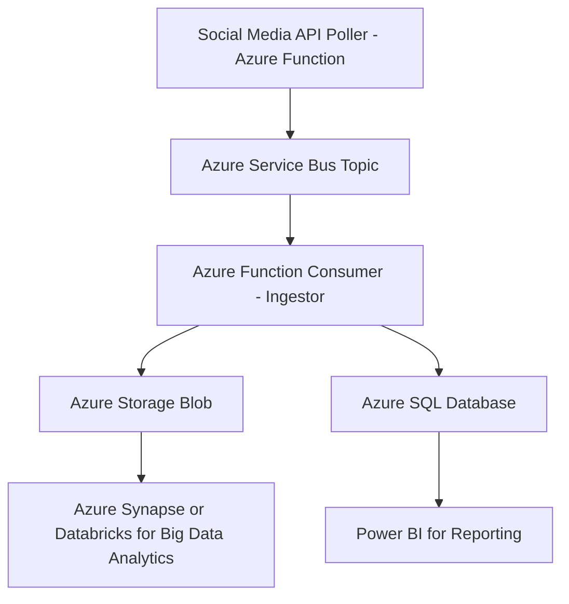

This is a great use case involving social media data aggregation, big data processing, and analytics for a **restaurant-centric social marketplace**. Let's break this down into the **overall scenario**, then define the **Azure architecture** and finally the **SQL tables** required for storing and analyzing the data.

---

## 🌐 **Scenario Summary**

The client wants to:

1. Group 27,000+ restaurants in one social marketplace.
2. Fetch metadata from **Instagram**, **Foursquare**, and **Twitter** for each restaurant.
3. Store and update this data **daily**.
4. Process and analyze this data using **Big Data analytics**.
5. Ensure high scalability, reliability, and cost-effective infrastructure.

---

## 🏗️ **Azure Architecture Components**



---

## ⚙️ **Azure Services Used**

| Component | Purpose |
|----------|---------|
| **Azure Function App** | Fetch metadata from Instagram, Twitter, Foursquare via API |
| **Azure Service Bus (Topic)** | Decouples producer (poller) and consumers (ingestors) |
| **Azure Storage Blob** | Stores raw JSON data from APIs |
| **Azure SQL Database** | Structured storage of restaurant metadata |
| **Azure Synapse / Azure Databricks** | Analyze the large volume of restaurant metadata |
| **Power BI** | Data visualization and reporting |
| **Azure Data Factory (optional)** | To schedule daily data movement/refresh pipelines |

---

## 🗃️ **SQL Database Tables Design**

Here are the main tables required to capture metadata, relationships, and update info:

---

### 1. **Restaurants**

```sql
CREATE TABLE Restaurants (
    RestaurantID INT PRIMARY KEY,
    Name NVARCHAR(255),
    Address NVARCHAR(500),
    City NVARCHAR(100),
    State NVARCHAR(100),
    Country NVARCHAR(100),
    ZipCode NVARCHAR(20),
    Latitude FLOAT,
    Longitude FLOAT,
    CreatedAt DATETIME DEFAULT GETDATE()
);
```

---

### 2. **SocialMediaSources**

```sql
CREATE TABLE SocialMediaSources (
    SourceID INT PRIMARY KEY,
    PlatformName NVARCHAR(50),  -- Instagram, Twitter, Foursquare
    APIEndpoint NVARCHAR(255),
    AuthType NVARCHAR(50)       -- OAuth2, BearerToken, etc.
);
```

---

### 3. **RestaurantSocialProfiles**

```sql
CREATE TABLE RestaurantSocialProfiles (
    ProfileID INT PRIMARY KEY,
    RestaurantID INT FOREIGN KEY REFERENCES Restaurants(RestaurantID),
    SourceID INT FOREIGN KEY REFERENCES SocialMediaSources(SourceID),
    SocialHandle NVARCHAR(100),
    LastChecked DATETIME,
    IsActive BIT,
    UNIQUE (RestaurantID, SourceID)
);
```

---

### 4. **SocialMediaMetadata**

```sql
CREATE TABLE SocialMediaMetadata (
    MetadataID INT PRIMARY KEY,
    ProfileID INT FOREIGN KEY REFERENCES RestaurantSocialProfiles(ProfileID),
    PostID NVARCHAR(100),
    PostURL NVARCHAR(500),
    Caption NVARCHAR(MAX),
    Likes INT,
    Comments INT,
    CreatedTime DATETIME,
    RawData NVARCHAR(MAX),     -- Optional: JSON blob
    IngestedAt DATETIME DEFAULT GETDATE()
);
```

---

### 5. **DailyFetchLog**

```sql
CREATE TABLE DailyFetchLog (
    LogID INT PRIMARY KEY,
    ProfileID INT FOREIGN KEY REFERENCES RestaurantSocialProfiles(ProfileID),
    FetchDate DATE,
    Status NVARCHAR(50),  -- Success, Failed, Partial
    Message NVARCHAR(MAX),
    RetryCount INT DEFAULT 0
);
```

---

## 📥 **Azure Storage Blob Structure (Raw Metadata)**

Each poll from the APIs can drop raw metadata in blob storage for archival and big data processing.

```
/rawdata/
  ├── instagram/
  │   └── 2025-03-28/
  │       └── restaurant_123.json
  ├── twitter/
  │   └── 2025-03-28/
  └── foursquare/
      └── 2025-03-28/
```

---

## 🔄 **Ingestion Flow Summary**

1. **Azure Function App**:
    - Scheduled trigger (e.g., every 24 hours)
    - Calls APIs of Twitter, Instagram, Foursquare
    - Publishes message to **Azure Service Bus** Topic with RestaurantID + SourceID

2. **Azure Function App (Consumer)**:
    - Subscribed to **Service Bus Topic**
    - Retrieves restaurant social media profile info
    - Parses and stores raw data into **Blob Storage**
    - Inserts structured metadata into **Azure SQL**
    - Logs status into `DailyFetchLog`

3. **Azure Synapse or Databricks**:
    - Processes raw JSON data from Blob Storage
    - Runs transformations and ML/AI analytics

4. **Power BI**:
    - Connects to **Azure SQL** and/or **Synapse**
    - Builds reports (e.g., trending restaurants, top posts, location heatmaps)

---

## 📊 **Optional Analytics Features**

- Top restaurants per city based on engagement
- Trend analysis of mentions/tags
- Sentiment analysis on captions/comments using Azure Cognitive Services
- ML-based popularity prediction

---

Absolutely! Let’s create both the **Terraform deployment template** and the **GitHub Actions CI/CD pipeline YAML** to deploy your solution on Azure.

---

## ✅ 1. **Terraform Deployment Template**

This template provisions the essential components:

- Azure Resource Group  
- Azure Storage Account  
- Azure Service Bus Namespace + Topic  
- Azure SQL Server + Database  
- Azure Function App  
- App Insights  

> **Note**: Customize names, SKUs, locations as per your environment.

### 📄 `main.tf`

```hcl
provider "azurerm" {
  features {}
}

variable "location" {
  default = "East US"
}

resource "azurerm_resource_group" "rg" {
  name     = "rg-social-marketplace"
  location = var.location
}

resource "azurerm_storage_account" "storage" {
  name                     = "socialmarketplacest"
  resource_group_name      = azurerm_resource_group.rg.name
  location                 = azurerm_resource_group.rg.location
  account_tier             = "Standard"
  account_replication_type = "LRS"
}

resource "azurerm_servicebus_namespace" "sb" {
  name                = "sb-social-marketplace"
  location            = azurerm_resource_group.rg.location
  resource_group_name = azurerm_resource_group.rg.name
  sku                 = "Basic"
}

resource "azurerm_servicebus_topic" "sb_topic" {
  name                = "restaurant-ingest-topic"
  namespace_id        = azurerm_servicebus_namespace.sb.id
}

resource "azurerm_application_insights" "appinsights" {
  name                = "insights-socialmarketplace"
  location            = azurerm_resource_group.rg.location
  resource_group_name = azurerm_resource_group.rg.name
  application_type    = "web"
}

resource "azurerm_app_service_plan" "appplan" {
  name                = "social-marketplace-plan"
  location            = azurerm_resource_group.rg.location
  resource_group_name = azurerm_resource_group.rg.name
  kind                = "FunctionApp"
  sku {
    tier = "Dynamic"
    size = "Y1"
  }
}

resource "azurerm_function_app" "function" {
  name                       = "func-socialmarketplace"
  location                   = azurerm_resource_group.rg.location
  resource_group_name        = azurerm_resource_group.rg.name
  app_service_plan_id        = azurerm_app_service_plan.appplan.id
  storage_account_name       = azurerm_storage_account.storage.name
  storage_account_access_key = azurerm_storage_account.storage.primary_access_key
  version                    = "~4"

  app_settings = {
    "AzureWebJobsStorage"           = azurerm_storage_account.storage.primary_connection_string
    "FUNCTIONS_EXTENSION_VERSION"   = "~4"
    "APPINSIGHTS_INSTRUMENTATIONKEY" = azurerm_application_insights.appinsights.instrumentation_key
    "WEBSITE_RUN_FROM_PACKAGE"      = "1"
  }
}

resource "azurerm_sql_server" "sqlserver" {
  name                         = "sqlserver-socialmarketplace"
  resource_group_name          = azurerm_resource_group.rg.name
  location                     = azurerm_resource_group.rg.location
  version                      = "12.0"
  administrator_login          = "sqladminuser"
  administrator_login_password = "SecureP@ssw0rd123!"
}

resource "azurerm_sql_database" "sqldb" {
  name                = "restaurantdb"
  resource_group_name = azurerm_resource_group.rg.name
  location            = azurerm_resource_group.rg.location
  server_name         = azurerm_sql_server.sqlserver.name
  sku_name            = "S0"
}
```

---

## 🔄 2. **GitHub Actions CI/CD YAML for Terraform**

Here’s how to integrate Terraform with GitHub Actions to **deploy infrastructure automatically** on commits to `main`.

### 📄 `.github/workflows/terraform-deploy.yml`

```yaml
name: Terraform Azure Deployment

on:
  push:
    branches:
      - main

env:
  ARM_CLIENT_ID: ${{ secrets.ARM_CLIENT_ID }}
  ARM_CLIENT_SECRET: ${{ secrets.ARM_CLIENT_SECRET }}
  ARM_SUBSCRIPTION_ID: ${{ secrets.ARM_SUBSCRIPTION_ID }}
  ARM_TENANT_ID: ${{ secrets.ARM_TENANT_ID }}

jobs:
  terraform:
    name: 'Terraform Plan & Apply'
    runs-on: ubuntu-latest

    steps:
      - name: Checkout Code
        uses: actions/checkout@v3

      - name: Setup Terraform
        uses: hashicorp/setup-terraform@v3
        with:
          terraform_version: 1.5.7

      - name: Terraform Init
        run: terraform init

      - name: Terraform Validate
        run: terraform validate

      - name: Terraform Plan
        run: terraform plan

      - name: Terraform Apply
        if: github.ref == 'refs/heads/main'
        run: terraform apply -auto-approve
```

---

## 🔐 GitHub Secrets to Configure

| Secret Name | Description |
|-------------|-------------|
| `ARM_CLIENT_ID` | From Azure Service Principal |
| `ARM_CLIENT_SECRET` | Service Principal password |
| `ARM_SUBSCRIPTION_ID` | Your Azure subscription ID |
| `ARM_TENANT_ID` | Azure AD tenant ID |

Use this command to create the **Service Principal**:
```bash
az ad sp create-for-rbac --role="Contributor" --scopes="/subscriptions/<subscription-id>"
```

---

